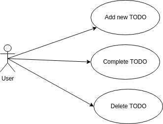

# exercises-in-java-style

Java Styles is a collection of Web Development approaches that aims to show Java Web Technologies since from 1997.  
This repository tries to keep the historical context for all styles, pointing out benefits and drawbacks.

In order to able you compare all approaches, we create a TODOist app specification that was used in every stack, that is organized by folder.

The main inspiration for this repo is the awesome book [Exercises in Programming Style](https://github.com/crista/exercises-in-programming-style) that shows up N programming approaches to solve the same problem.

### TODOist

### Requirements

- Java 1.8

- Docker 

### Fork and contribute

Want to contribute? Fork it and send us your PR
